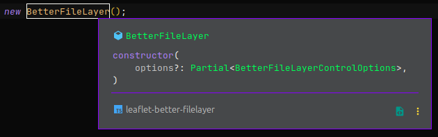
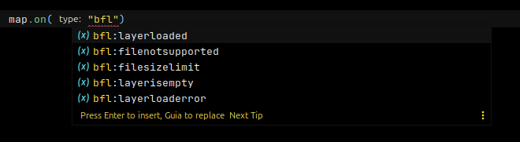
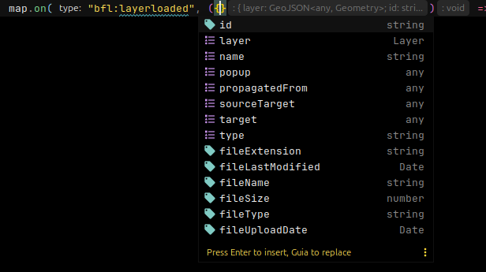

# Leaflet.BetterFileLayer

### Load your spatialized files into Leaflet the way it should be.


---

This is a [Leaflet](http://leafletjs.com/) plugin for loading your spatialized data into leaflet based on [leaflet-omnivore](https://github.com/mapbox/leaflet-omnivore)
and [Leaflet.FileLayer](https://github.com/makinacorpus/Leaflet.FileLayer) plugins. This plugin was made looking for a convenient and easy to use
plugin for loading external spatial files to leaflet.

It currently supports:

* [GeoJSON](http://geojson.org/) (
  via [JSON](https://developer.mozilla.org/en-US/docs/Web/JavaScript/Reference/Global_Objects/JSON))
* [JSON](http://geojson.org/) (Using the GeoJSON structure)
* [CSV](http://en.wikipedia.org/wiki/Comma-separated_values) (via [csv2geojson](https://github.com/mapbox/csv2geojson))
* [GPX](https://wiki.openstreetmap.org/wiki/GPX) (
  via [togeojson](https://github.com/mapbox/togeojson))
* [KML](https://developers.google.com/kml/documentation/) (
  via [togeojson](https://github.com/mapbox/togeojson))
* [KMZ](https://developers.google.com/kml/documentation/kmzarchives) (
  via [zip.js](https://github.com/gildas-lormeau/zip.js/) + [togeojson](https://github.com/mapbox/togeojson))
* [WKT](http://en.wikipedia.org/wiki/Well-known_text) (via [wellknown](https://github.com/mapbox/wellknown))
* [TopoJSON](https://github.com/mbostock/topojson) (via [topojson-client](https://github.com/topojson/topojson-client))
* [Encoded Polylines](https://developers.google.com/maps/documentation/utilities/polylinealgorithm) (
  via [polyline](https://github.com/mapbox/polyline))
* [Shapefile](https://en.wikipedia.org/wiki/Shapefile) (
  via [shpjs](https://github.com/calvinmetcalf/shapefile-js/tree/gh-pages)) (zipped or separate files)

## Installation

### For Leaflet 2.x
```commandline
npm install leaflet-better-filelayer
```

### For Leaflet 1.x
```commandline
npm install leaflet-better-filelayer@1.0.1
```

## Demo

Checkout the [Demo](https://gabriel-russo.github.io/Leaflet.BetterFileLayer/example/)

Checkout the [Demo with external button](https://gabriel-russo.github.io/Leaflet.BetterFileLayer/example/with-button.html)

Below gif show an example of loading a separated shapefile using drag and drop.

Note: Internally, the plugin groups `.shp`, `.dbf`, `.shx` and `.prj` with the same name.


## Usage

```js
import { BetterFileLayer } from "leaflet-better-filelayer";

const map = new Map('map');

const bfl = new BetterFileLayer();

map.addControl(bfl);
```

## Documentation

### For Leaflet 2.x

> [Go to Wiki page](https://github.com/gabriel-russo/Leaflet.BetterFileLayer/wiki)

### For Leaflet 1.x

> [Go to Wiki page](https://github.com/gabriel-russo/Leaflet.BetterFileLayer/wiki)

And

> [Go to 1.0.1 tag](https://github.com/gabriel-russo/Leaflet.BetterFileLayer/tree/1.0.1)

## Typescript support





### Custom html button

If you are developing a web application and you want to use your own html button outside the map container, you can use
the following code:

```js
// Note: The input have to be type "file"
// Example: <input type="file" accept=".gpx,.kml,.geojson,.json" multiple />
const options = {
  button: document.getElementById('my-button'), // Your input HTML reference
}

const bfl = new BetterFileLayer(options).addTo(map);
```

After that, the plugin will bind an "on change" event on this button, waiting for files.

You can see the example [here](https://gabriel-russo.github.io/Leaflet.BetterFileLayer/example/with-button.html)

`Note:` The Drag and Drop event listener will bind it self automatically

## Development

Install the development dependencies

```commandline
npm install --save-dev
```

Start Vite development mode

```commandline
npm run dev
```

Open `localhost:3000` in your browser and start editing `index.html`.

### Test

To run unity tests:

```commandline
npm run test
```

### Linting & Code Style

```commandline
npm run style && npm run lint
```

## Contributors

- Gabriel Russo <gabrielrusso@protonmail.com>

## License

- Copyright (c) 2026, Gabriel Russo
- Copyright (c) 2014, Mapbox
- Copyright (c) 2012, Michael Bostock
- Copyright (c) 2012 Makina Corpus

See [License](https://github.com/gabriel-russo/Leaflet.BetterFileLayer/blob/master/LICENSE) for more details
