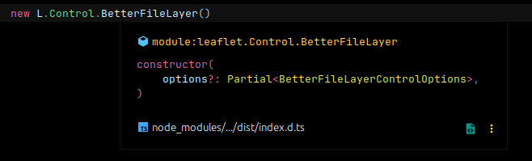

# Leaflet.BetterFileLayer

### Load your spatialized files into Leaflet the way it should be.


---

This is a [Leaflet](http://leafletjs.com/) plugin for loading your spatialized data into leaflet based
on [leaflet-omnivore](https://github.com/mapbox/leaflet-omnivore)
and [Leaflet.FileLayer](https://github.com/makinacorpus/Leaflet.FileLayer) plugins.
This plugin was made looking for a convenient and easy to use plugin for loading external spatial files to leaflet.

It currently supports:

* [GeoJSON](http://geojson.org/)
* [JSON](http://geojson.org/) (Using the GeoJSON structure)
* [CSV](http://en.wikipedia.org/wiki/Comma-separated_values) (via [csv2geojson](https://github.com/mapbox/csv2geojson))
* [GPX](https://wiki.openstreetmap.org/wiki/GPX)
* [KML](https://developers.google.com/kml/documentation/)
* [KMZ](https://developers.google.com/kml/documentation/kmzarchives)
* [WKT](http://en.wikipedia.org/wiki/Well-known_text) (via [wellknown](https://github.com/mapbox/wellknown))
* [TopoJSON](https://github.com/mbostock/topojson) (via [topojson-client](https://github.com/topojson/topojson-client))
* [Encoded Polylines](https://developers.google.com/maps/documentation/utilities/polylinealgorithm) (
  via [polyline](https://github.com/mapbox/polyline))
* [Shapefile](https://en.wikipedia.org/wiki/Shapefile) (
  via [shpjs](https://github.com/calvinmetcalf/shapefile-js/tree/gh-pages)) (zipped or separate files)

## Installation

```commandline
npm install leaflet-better-filelayer
```

## Demo

Checkout the [Demo](https://gabriel-russo.github.io/Leaflet.BetterFileLayer/example/)

Checkout
the [Demo with external button](https://gabriel-russo.github.io/Leaflet.BetterFileLayer/example/with-button.html)

Below gif show an example of loading a separated shapefile using drag and drop.

Note: The plugin only looks for `.shp`, `.dbf`, `.shx`, `.prj` with the same name.


## Usage

As map option:

```js
const map = L.map('map', { betterFileLayerControl: true })
```

Or like any control

```js
L.control.betterFileLayer()
  .addTo(map);

// or

const control = new L.Control.BetterFileLayer();

control.addTo(map);
```

## Documentation

> [Go to Wiki page](https://github.com/gabriel-russo/Leaflet.BetterFileLayer/wiki)

## Typescript support




### Custom html button

If you are developing a web application and you want to use your own html button outside the map container, you can use
the following code:

```js
// Note: The button have to be type "file"
// Example: <input type="file" accept=".gpx,.kml,.geojson,.json" multiple />
const options = {
  button: document.getElementById('my-button'), // Your button HTML reference
}

const control = L.control.betterFileLayer(options)
  .addTo(map);
```

After that, the plugin will bind an "on change" event on this button, waiting for files.

You can see the example [here](https://gabriel-russo.github.io/Leaflet.BetterFileLayer/example/with-button.html)

`Note:` The Drag and Drop event listener will bind it self automatically

#### For Framework (React, Angular...) devs

To be less painful to handle render states with Frameworks + Leaflet Control, you can bind the button
later, doing this:

```ts
const options = {
    will_bind_button_later: true
}

const control = L.control.betterFileLayer(options)
    .addTo(map);

// Example using React
// ref = useRef();....
// <input ref={ref} ... />
control.bind_button(ref.current);
```

## Development

Install the development dependencies

```commandline
npm install --save-dev
```

`npm run build` after any change and check changes.

Open `index.html` in your browser and start editing.

### Test

To run unity tests:

```commandline
npm run test
```

## Authors

- Gabriel Russo <gabrielrusso@protonmail.com>

## Credits

- Copyright (c) 2025, Gabriel Russo
- Copyright (c) 2014, Mapbox
- Copyright (c) 2012, Michael Bostock
- Copyright (c) 2012 Makina Corpus

See [License](https://github.com/gabriel-russo/Leaflet.BetterFileLayer/blob/master/LICENSE) for more details
